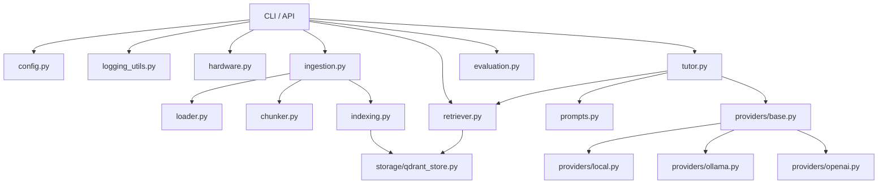

# Estructura del MVP RAG local-first

Este documento resume la separación mínima de responsabilidades para el proyecto `local-teacher`.

## Lectura rápida

- `loader.py`: lee archivos elegidos por el usuario.
- `chunker.py`: divide el texto en fragmentos reutilizables.
- `storage/qdrant_store.py`: guarda y recupera vectores.
- `retriever.py`: obtiene el contexto más útil para una consulta.
- `tutor.py`: arma la respuesta con tono de profesor.
- `providers/*`: cambian entre modelo local y API externa.
- `prompts.py`: centraliza instrucciones pedagógicas.
- `evaluation.py`: prepara quiz, examen y retroalimentación.
- `logging_utils.py` y `hardware.py`: soporte transversal del sistema.

## Orden recomendado de implementación

1. `loader.py`
2. `chunker.py`
3. `storage/qdrant_store.py`
4. `retriever.py`
5. `providers/local.py`
6. `tutor.py`
7. `evaluation.py`
8. `app.py` o `cli.py`
