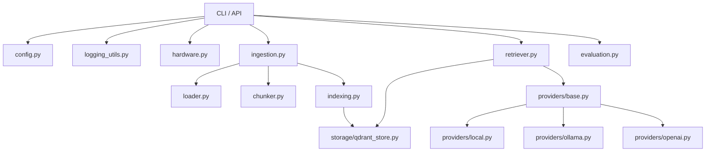

# Estructura del MVP RAG local-first

Este documento resume la separación mínima de responsabilidades para el proyecto `local-teacher`.

## Responsabilidades

- `loader.py`: lee y normaliza archivos; usa Docling como backend PDF principal.
- `chunker.py`: divide el contenido y conserva metadata.
- `storage/qdrant_store.py`: persiste y consulta vectores.
- `retriever.py`: recupera el contexto relevante y **actúa como tutor**, inyectando el contexto recuperado en el prompt y gestionando la generación en *streaming* de las respuestas usando el LLM provisto.
- `providers/*`: abstraen Ollama y proveedores API opcionales.
- Metadata: relaciona documento, página, sección, figura y tabla.
- CLI: expone la ingesta, consulta (con respuestas generadas en tiempo real) y configuración mínima.

## Estado

Actualmente existen loaders, chunker, almacenamiento, recuperación,
CLI interactivo y proveedores Ollama/OpenAI. El contrato formal de metadata y los proveedores Claude/Gemini están pendientes.

## Orden recomendado de implementación

1. Contrato común de metadata.
2. Loaders de texto y PDF.
3. Chunker.
4. Embeddings y almacenamiento Qdrant.
5. Recuperación.
6. Tutor.
7. Proveedores opcionales.
8. Evaluación y futura interfaz.

